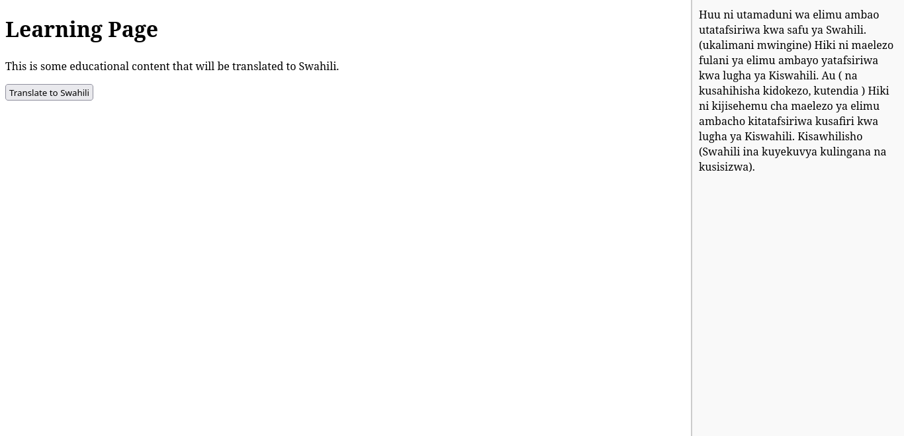
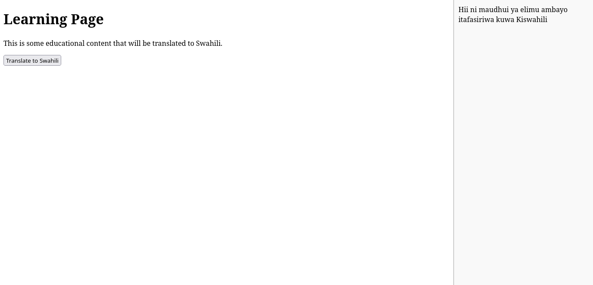
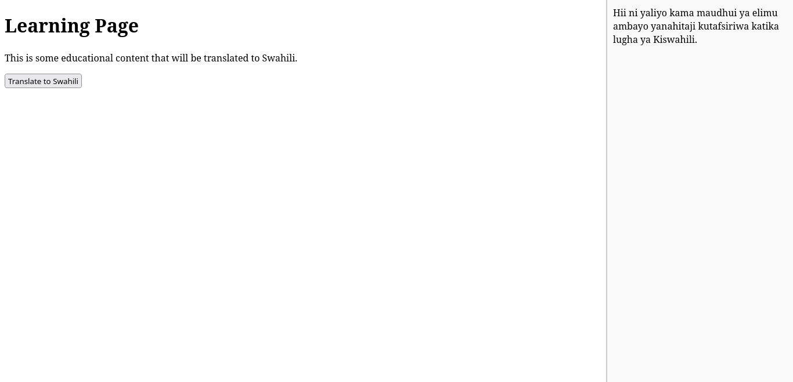

# CODEUJUZI

+ CodeUjuzi is a skill-learning platform that offers free courses in a variety of
topics through a website.

##  Overview
+ **Learning Approach:** Interactive lessons, quizzes, and games to make learning fun.
+ **Gamification:** Users earn points, unlock levels, and maintain streaks for daily practice.
+ **Language Support:** Offers courses in Swahili, Dholuo, Kikuyu, and others.
+ **User-Friendly Design:** Bite-sized lessons for accessibility and engagement.

An adaptive learning interface >> skills: that enhance employability.
+ personalised learning systems.
+ automated tutoring.
+ educational content that bridges the knowledge gap.
+ STEM :: Technology; How to solve solutions using technology through Code: how to use computers,how to use AI.
+ Swahili, Kikuyu, Luo...

## Initialize Node.js Project
1. Open a terminal in your project folder (~/Documents/codeujuzi).
2. Run the following command to initialize a Node.js project:
```bash
npm init -y
```

##  Install Dependencies
Now that you have the package.json file, you need to install the express and groq-sdk modules.

1. In your project directory, run the following commands:

 To install express:
 ```bash
 npm install express
```
To install groq-sdk:
```bash
npm install groq-sdk
```
##  Create .env File for API Key

You need to set the GROQ_API_KEY environment variable, which is used by the Groq SDK. Follow these steps:

1. In your project directory, create a .env file:
```bash
touch .env
```
2. Open .env and add your Groq API key:
```bash
GROQ_API_KEY=your-api-key-here
```
3. Install the dotenv package to load environment variables:
```bash
npm install dotenv
```
4. In your app.js file, add the following line at the top to load the .env file:
```bash
require('dotenv').config();
```
## Run the Application
```bash
node app.js
```
You should see this message if everything is working:
```bash
Server running on port 3000
```

## Key Features

1. Sign-Up Process:
    - Email authentication or Google sign-in.
    - Collect gender orientation, KYC details, and preferred tribal language.

2. Utilizing LLaMA:
    - Eliminate gender biases in learning materials.
    - Continuous evaluation of model performance to ensure non-discriminatory results.
    - Customize content for diverse gender needs.
    - Content moderation to filter out biased or insensitive language.

3. Focus on African Languages:
    - Fine-tune LLaMA for African languages.
    - Incorporate cultural context to respect and preserve linguistic identities.
    - Develop teaching materials for African languages.


## Next Steps
1. Platform Development
2. Content Creation
3. Engagement

## Look


[source of template  ](https://themes.getbootstrap.com/preview/?theme_id=103332)


## Successfull implementation of transalation
Example 1 with same content








