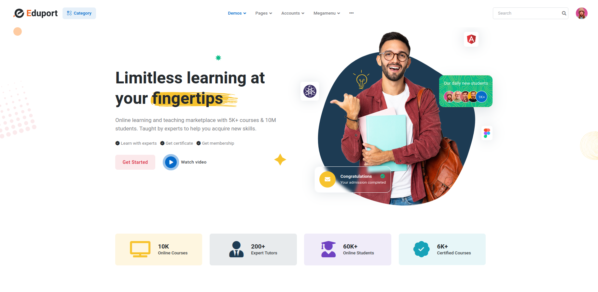

# CODEUJUZI

+ CodeUjuzi is a skill-learning platform that offers free courses in a variety of
topics through a website.

##  Overview
+ **Learning Approach:** Interactive lessons, quizzes, and games to make learning fun.
+ **Gamification:** Users earn points, unlock levels, and maintain streaks for daily practice.
+ **Language Support:** Offers courses in Swahili, Dholuo, Kikuyu, and others.
+ **User-Friendly Design:** Bite-sized lessons for accessibility and engagement.

A adaptive learning interface >> skills: that enhance employability.
+ personalised learning systems.
+ automated tutoring.
+ educational content that bridges the knowledge gap.
+ STEM :: Technology; How to solve solutions using technology through Code: how to use computers,how to use AI.
+ Swahili, Kikuyu, Luo...

## Key Features

1. Sign-Up Process:
    - Email authentication or Google sign-in.
    - Collect gender orientation, KYC details, and preferred tribal language.

2. Utilizing LLaMA:
    - Eliminate gender biases in learning materials.
    - Continuous evaluation of model performance to ensure non-discriminatory results.
    - Customize content for diverse gender needs.
    - Content moderation to filter out biased or insensitive language.

3. Focus on African Languages:
    - Fine-tune LLaMA for African languages.
    - Incorporate cultural context to respect and preserve linguistic identities.
    - Develop teaching materials for African languages.

## Next Steps
1. Platform Development
2. Content Creation
3. Engagement

## Look

